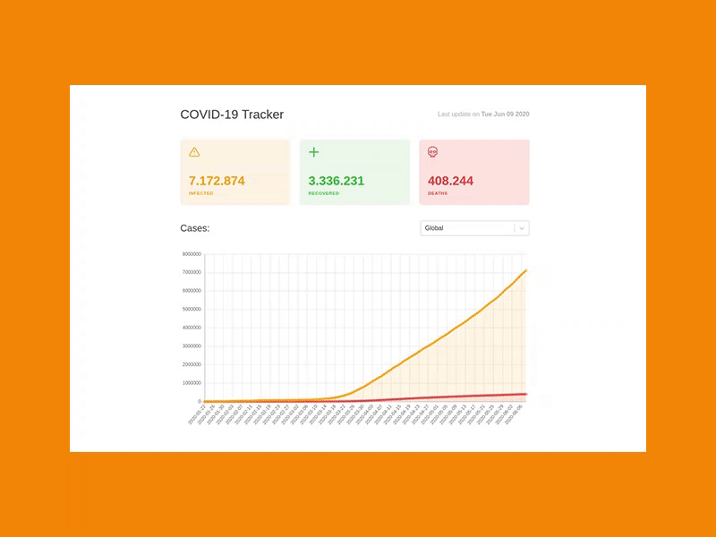

## COVID-19 Tracker

A simple web application to track the infected, recovered, and deaths caused by Coronavirus across all over the world using ReactJS, ChartJS, and React-Select. 



Link to the App: [COVID-19 Tracker](https://itstaranarora.github.io/covid19-tracker/)

### How to use
```
$ git clone git@github.com:sammarxz/02-Covid-Tracker.git
$ cd 02-Covid-Tracker.git
$ npm install
$ yarn start
```

### ToDo
* [ ] - Add More Charts and tables